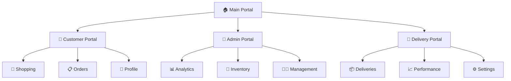
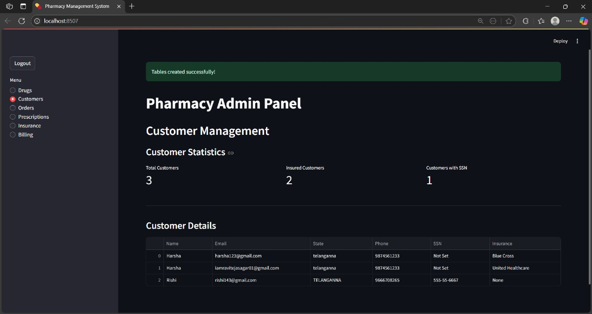
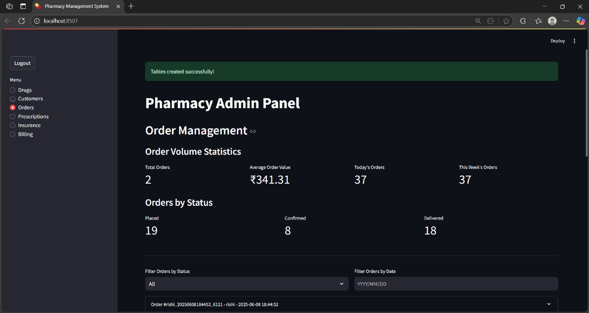

# 💊 Pharmacy Management System

<div align="center">

```
    ╔═══════════════════════════════════════════════════════════════╗
    ║  ____  _                                                      ║
    ║ |  _ \| |__   __ _ _ __ _ __ ___   __ _  ___ _   _              ║
    ║ | |_) | '_ \ / _` | '__| '_ ` _ \ / _` |/ __| | | |             ║
    ║ |  __/| | | | (_| | |  | | | | | | (_| | (__| |_| |             ║
    ║ |_|   |_| |_|\__,_|_|  |_| |_| |_|\__,_|\___|\__, |             ║
    ║                                             |___/              ║
    ║                  Management System                            ║
    ╚═══════════════════════════════════════════════════════════════╝
```


**A comprehensive pharmacy management system built with modern web technologies**

[🚀 Quick Start](#-quick-start) • [📋 Features](#-features) • [🛠️ Tech Stack](#-tech-stack) • [📱 Portals](#-system-portals) • [💾 Database](#-database-setup)

</div>

---

## 🌟 Project Overview

Welcome to our state-of-the-art **Pharmacy Management System** - a full-stack solution designed to revolutionize how pharmacies operate in the digital age. Built by **Raviteja Dasarigalla** and collaborator for the Database Management System course, this project showcases modern software engineering principles and database design expertise.

### 🎯 What Makes This Special?

```
🔹 Multi-Portal Architecture    🔹 Real-time Order Tracking
🔹 Secure Authentication       🔹 Inventory Management  
🔹 Interactive Dashboard       🔹 Delivery Integration
🔹 Responsive Design          🔹 Performance Analytics
```

---

## 📋 Features

<table>
<tr>
<td width="33%">

### 👥 **Customer Portal**
```
✅ User Registration & Auth
✅ Drug Search & Browse
✅ Smart Shopping Cart
✅ Order Tracking
✅ Prescription Upload
✅ Profile Management
✅ Order History
```

</td>
<td width="33%">

### 🏥 **Admin Portal**
```
✅ Inventory Management
✅ Order Processing
✅ Agent Management
✅ Analytics Dashboard
✅ Revenue Tracking
✅ User Management
✅ System Reports
```

</td>
<td width="33%">

### 🚚 **Delivery Portal**
```
✅ Order Assignment
✅ Status Updates
✅ Route Optimization
✅ Performance Stats
✅ Profile Management
✅ Delivery History
✅ Earnings Tracker
```

</td>
</tr>
</table>

---

## 🛠️ Tech Stack

<div align="center">

| **Frontend** | **Backend** | **Database** | **Libraries** |
|:---:|:---:|:---:|:---:|
|  |  |  |  |
| Interactive UI | Core Logic | Data Storage | Data Processing |

</div>

```python
# 🔧 Core Technologies
FRONTEND = "Streamlit"        # Modern web framework
BACKEND = "Python 3.x"       # Robust server-side logic
DATABASE = "MySQL"           # Reliable data management
VISUALIZATION = "Pandas"     # Data analytics & reporting
IMAGE_PROCESSING = "PIL"     # Prescription handling
```

---

## 🚀 Quick Start

### 📥 Installation

```bash
# 1️⃣ Clone the repository
git clone https://github.com/Dasarigalla-Raviteja/pharmacy-management-system.git
cd pharmacy-management-system

# 2️⃣ Create virtual environment (recommended)
python -m venv pharmacy_env
source pharmacy_env/bin/activate  # On Windows: pharmacy_env\Scripts\activate

# 3️⃣ Install dependencies
pip install -r requirements.txt

# 4️⃣ Launch the application
python -m streamlit run file.py
```

### ⚡ Quick Setup Checklist

- [ ] Python 3.7+ installed
- [ ] MySQL server running
- [ ] Dependencies installed
- [ ] Database configured
- [ ] Application launched

---

## 📱 System Portals

<div align="center">



</div>

### 🎭 Portal Features Breakdown

| Portal | Primary Users | Key Functions |
|--------|---------------|---------------|
| **👥 Customer** | End Users | Browse, Order, Track, Manage |
| **🏥 Admin** | Pharmacy Staff | Inventory, Analytics, Management |
| **🚚 Delivery** | Delivery Agents | Accept, Track, Update, Deliver |

---

## 💾 Database Setup

### 🗄️ Database Architecture

```sql
-- 📊 Core Tables Structure
┌─────────────────┬─────────────────┬─────────────────┐
│     USERS       │     DRUGS       │     ORDERS      │
├─────────────────├─────────────────├─────────────────┤
│ • User ID       │ • Drug ID       │ • Order ID      │
│ • Username      │ • Name          │ • Customer ID   │
│ • Email         │ • Description   │ • Total Amount  │
│ • Password      │ • Price         │ • Status        │
│ • Role          │ • Stock         │ • Date          │
│ • Created Date  │ • Category      │ • Delivery ID   │
└─────────────────┴─────────────────┴─────────────────┘
```

### 🔧 Setup Instructions

1. **Create Database**
   ```sql
   CREATE DATABASE pharmacy_management;
   USE pharmacy_management;
   ```

2. **Configure Connection**
   ```python
   # Update database credentials in config
   DATABASE_CONFIG = {
       'host': 'localhost',
       'user': 'your_username',
       'password': 'your_password',
       'database': 'pharmacy_management'
   }
   ```

3. **Initialize Tables**
   - Tables are auto-created on first run
   - Sample data can be loaded via Admin panel

---

## 🎨 Screenshots & Demo

<div align="center">

### 📱 Application Screenshots

| **Main Dashboard** | **System Interface** |
|:---:|:---:|
|  |  |
| *Main portal selection and navigation* | *Core system functionality* |

### 🖥️ Dashboard Preview
```
┌─────────────────────────────────────────────────────────────┐
│  🏠 Pharmacy Management System                              │
├─────────────────────────────────────────────────────────────┤
│                                                             │
│  👥 Customer Portal    🏥 Admin Portal    🚚 Delivery      │
│  ┌─────────────────┐  ┌─────────────────┐  ┌─────────────┐  │
│  │ 🛒 Shop Drugs   │  │ 📊 Analytics    │  │ 📦 Orders   │  │
│  │ 📋 My Orders    │  │ 💊 Inventory    │  │ 🚚 Deliver  │  │
│  │ 👤 Profile      │  │ 👨‍💼 Manage      │  │ 📈 Stats    │  │
│  └─────────────────┘  └─────────────────┘  └─────────────┘  │
│                                                             │
└─────────────────────────────────────────────────────────────┘
```

</div>

---

## 🔧 Usage Guide

### 🚀 Getting Started

1. **Launch Application**
   ```bash
   python -m streamlit run file.py
   ```

2. **Access Web Interface**
   - Open browser to `http://localhost:8501`
   - Select appropriate portal
   - Login or register new account

3. **Portal Navigation**
   - **Customers**: Browse → Add to Cart → Checkout → Track
   - **Admins**: Monitor → Manage → Analyze → Report
   - **Delivery**: Accept → Update → Deliver → Complete

### 📊 Key Workflows

```
Customer Journey:
Registration → Browse Drugs → Add to Cart → Checkout → Track Order → Receive

Admin Workflow:
Login → Dashboard → Inventory Management → Order Processing → Analytics

Delivery Process:
Login → View Orders → Accept Delivery → Update Status → Complete
```

---

## 🎯 Project Highlights

### 🏆 Technical Achievements

- **🔐 Secure Authentication**: Multi-role user management
- **📊 Real-time Analytics**: Live dashboard with insights
- **🚚 Delivery Integration**: End-to-end order tracking
- **💊 Smart Inventory**: Automated stock management
- **📱 Responsive Design**: Cross-platform compatibility

### 🎓 Learning Outcomes

- **Database Design**: Normalized schema with proper relationships
- **Web Development**: Modern full-stack architecture
- **User Experience**: Intuitive multi-portal interface
- **Security**: Authentication and authorization implementation
- **Analytics**: Data visualization and reporting

---

## 📈 Future Enhancements

<div align="center">

| **Phase 1** | **Phase 2** | **Phase 3** |
|:---:|:---:|:---:|
| 🔔 Notifications | 🤖 AI Recommendations | 🌐 API Integration |
| 📧 Email Alerts | 📊 Advanced Analytics | 📱 Mobile App |
| 💳 Payment Gateway | 🔍 ML Search | ☁️ Cloud Deployment |

</div>

---

## 🤝 Contributing

We welcome contributions! Here's how you can help:

```bash
# 1️⃣ Fork the repository
# 2️⃣ Create feature branch
git checkout -b feature/amazing-feature

# 3️⃣ Commit changes
git commit -m 'Add amazing feature'

# 4️⃣ Push to branch
git push origin feature/amazing-feature

# 5️⃣ Open Pull Request
```

---

## 👨‍💻 Team

<div align="center">

### 🎯 Development Team

| **Role** | **Name** | **Contribution** |
|:---:|:---:|:---:|
| 🚀 **Lead Developer** | **Raviteja Dasarigalla** | System Architecture, Core Development |
| 💻 **Co-Lead Developer** | **Hanish Kumar** | Database Design, Feature Implementation |

### 📞 Contact Information

**Raviteja Dasarigalla**  
📧 Email: [iamravitejasagar01@gmail.com](mailto:iamravitejasagar01@gmail.com)  
🐙 GitHub: [@Dasarigalla-Raviteja](https://github.com/Dasarigalla-Raviteja)  

**Hanish Kumar**  
📧 Email: [hanish.kumar9193@gmail.com](mailto:hanish.kumar9193@gmail.com)  
🐙 GitHub: [@hanish9193](https://github.com/hanish9193)  

🔗 Project: [pharmacy-management-system](https://github.com/Dasarigalla-Raviteja/pharmacy-management-system)

</div>

---

## 📄 License

```
MIT License

Copyright (c) 2024 Raviteja Dasarigalla

Permission is hereby granted, free of charge, to any person obtaining a copy
of this software and associated documentation files (the "Software"), to deal
in the Software without restriction, including without limitation the rights
to use, copy, modify, merge, publish, distribute, sublicense, and/or sell
copies of the Software, and to permit persons to whom the Software is
furnished to do so, subject to the following conditions:

The above copyright notice and this permission notice shall be included in all
copies or substantial portions of the Software.
```

---

<div align="center">

### 🌟 Show Your Support

If you found this project helpful, please consider:

⭐ **Starring** the repository  
🍴 **Forking** for your own use  
🐛 **Reporting** issues  
💡 **Suggesting** improvements  

---

**Made with ❤️ by Raviteja & Hanish Kumar**

```
Thank you for checking out our Pharmacy Management System!
Built with passion for Database Management System course 🎓
```

</div>
